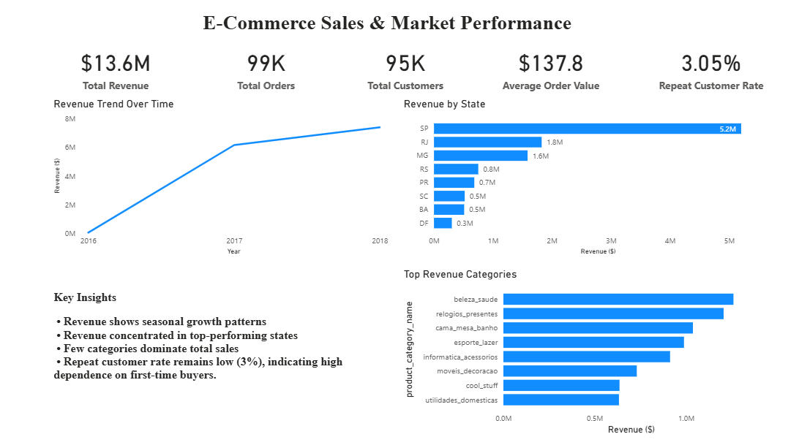
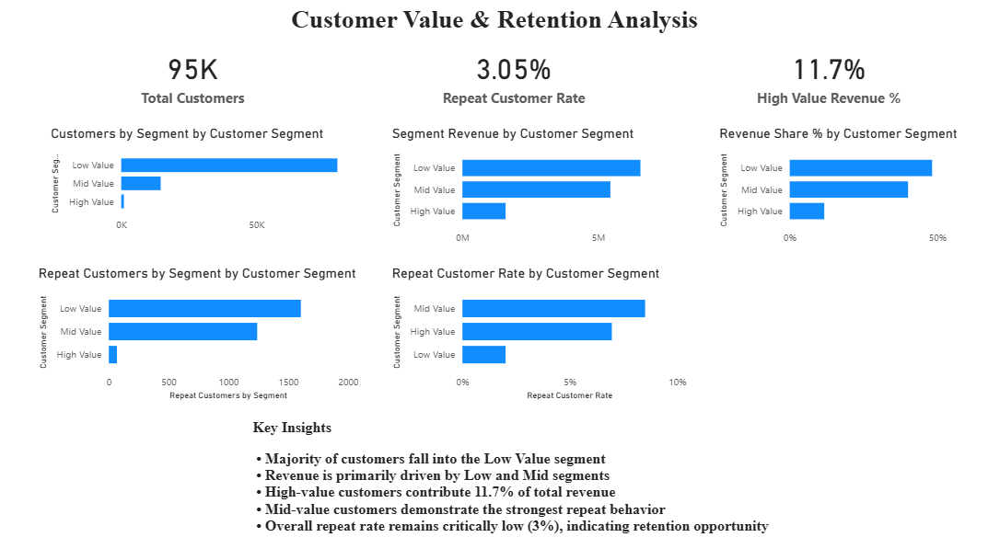

# ecommerce-sql-powerbi-analytics
SQL + Power BI dashboard analyzing e-commerce revenue performance, customer segmentation, and retention metrics.

# Ecommerce Sales & Customer Analytics (Power BI + PostgreSQL)

This project presents a two-page Business Intelligence dashboard analyzing sales performance, customer segmentation, and retention behavior for an e-commerce marketplace.

The objective is to transform raw transactional data into executive-level insights and strategic recommendations.

---

## Project Overview

The dashboard focuses on:

- Revenue performance analysis
- Geographic sales distribution
- Product category contribution
- Customer segmentation (Low / Mid / High value)
- Revenue concentration analysis
- Repeat customer behavior and retention insights

The analysis combines SQL data modeling in PostgreSQL with DAX-based analytics in Power BI.

---

## Tools & Technologies Used

- PostgreSQL (pgAdmin 4)
- SQL (Views, Aggregations, Joins)
- Power BI
- DAX (Measures & Calculated Columns)
- Data Modeling
- KPI Development
- Business Insight Storytelling

---

## Data Preparation (SQL Layer)

Created SQL views for clean BI modeling:

- `monthly_sales`
- `revenue_by_state`
- `revenue_by_category`
- `customer_summary`

These views aggregated transactional data to support optimized Power BI performance.

---

# Dashboard Structure

## Page 1 – E-Commerce Sales & Market Performance

Executive overview including:

- Total Revenue ($13.6M)
- Total Orders (99K)
- Total Customers (95K)
- Average Order Value ($137.8)
- Repeat Customer Rate (3.05%)

Visual Analysis:
- Revenue trend over time
- Revenue by state (Top N filtering)
- Top revenue-driving product categories
- Strategic insights summary

---

## Page 2 – Customer Value & Retention Analysis

Customer intelligence layer including:

- Customer segmentation (Low / Mid / High value)
- Segment revenue contribution
- Revenue share %
- Repeat rate by segment
- High-value revenue concentration (11.7%)

Key Findings:
- Majority of customers fall into the Low Value segment
- Revenue primarily driven by Low and Mid segments
- High-value customers contribute 11.7% of total revenue
- Mid-value customers show strongest repeat behavior
- Overall repeat rate remains critically low (3%), indicating retention opportunity

---

## Business Insights

This analysis reveals:

- Revenue growth trend over time
- Geographic concentration in top-performing states
- Category revenue dominance
- Heavy dependence on first-time buyers
- Retention improvement opportunity through mid-value segment targeting

---

## What This Project Demonstrates

- End-to-end BI workflow (SQL → Power BI)
- KPI design and executive dashboard layout
- Customer segmentation logic
- Revenue concentration modeling
- Retention analysis
- Strategic storytelling using data

---

## Dashboard Preview
- 
- 

---

## Conclusion

This project demonstrates how structured data modeling and BI reporting can uncover revenue concentration risks, customer value dynamics, and retention opportunities within an e-commerce business.

The final dashboard is designed for executive decision-making and strategic planning.
